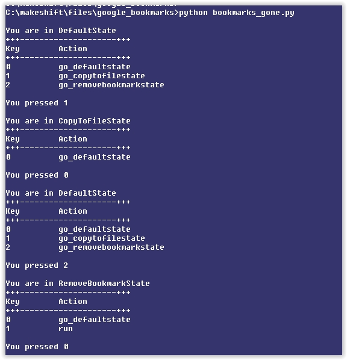
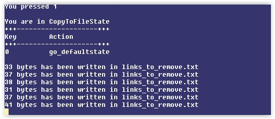
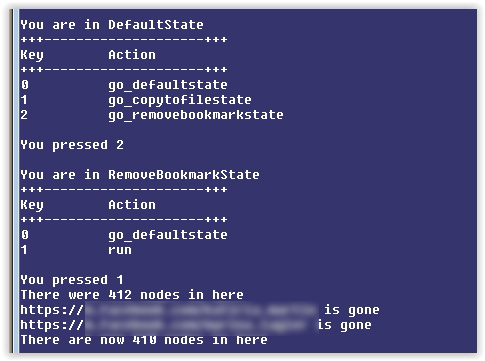

# State Design Pattern & Microsoft Windows API (Chrome Bookmarks)

As I wrote in a previous repository, I always wanted to try out the Windows API since I was a kid. I used to program in BASIC in Commodore 64 when I was very young, and my friends were using programs to move/click/drag their mouse in Windows API & C++ in perfect shapes. They were doing all this crazy wizard stuff to impress everybody and I wanted in.

The deep comprehensive Win32 API is one of those bucket list things.

> The Windows architecture is heavily layered. Function calls that a programmer makes may be redirected 3 times or more before any action is actually performed. There is an unignorable penalty for calling Win32 functions from a user-mode application. However, the upside is equally unignorable: code written in higher levels of the windows system is much easier to write. Complex operations that involve initializing multiple data structures and calling multiple sub-functions can be performed by calling only a single higher-level function. The Win32 API comprises 3 modules: KERNEL32, USER32, and GDI32. KERNEL32 is layered on top of NTDLL, and most calls to KERNEL32 functions are simply redirected into NTDLL function calls. USER32 and GDI32 are both based on WIN32K (a kernel-mode module, responsible for the Windows "look and feel"), although USER32 also makes many calls to the more-primitive functions in GDI32. This and NTDLL both provide an interface to the Windows NT kernel, NTOSKRNL

I reached a point where I had many multiple use cases, and making a program has accomplished all of them in a fell swoop.

1. Needed to learn more about the State Design Pattern (and design patterns in general)
2. I badly needed to clean up my Internet bookmarks in a much faster, automated way
3. I wanted to work more with the low level Win32 functions

Enter the Google Bookmarks program that solves all of this for me. I made this into a menu format where the State Design Pattern/State Machine was used, just for experimentation. It allowed for this to be extended for many other new features via other new states in the states folder, which will be menu options.

Here is the initial menu you will see in the State Design Pattern:



Win32 is used here for two purposes. Record Keystrokes, and listen to Clipboard changes, and run a callback function/book when the clipboard changes. In one state, the Clipboard will record the links in a text file that will be removed from the Google Bookmarks when moving into another "State"

I made an entire headless window JUST to record Clipboard Listeners to run a callback function. This might have been overkill in retrospect and maybe it could have been condensed. This is the same process to make a pure Window in C or Python without using dependencies like TKinter or GTK.

I figure, WHY use these dependencies and tools others have made when I can go into the low-level details that's documented (unlike ntdll.dll and of course the Kernel which I don't even have the time to experiment with)

I wrote this in a separate blog post.

> I am happy I did this attached handywork in my free time. It organizes my Google Bookmarks in a menu using the STATE Design Pattern, and the language was Python, and I made sure I used the difficult unwieldy 1980's Microsoft Windows API, instead of relying on readymade frameworks like .Net or Universal Windows Platform which obfuscate details. REAL professionals will WANT to know those details to be more indispensible. I just wanted to know some the low-level details near the kernel level at ntdll.dll, and improve on my design patterns (practically), by stuggling intensely to come out to the other side a stronger developer like the more "senior" members of my team. I want to be a senior developer, CIO & owner & have near PHD knowledge of this. I love what the Windows API can do, by knowing the low-level details, you are simply a better developer, you just know more about conventional languages which hide details, and you could troubleshoot problems that the easy languages can't, and you can simply DO MORE THINGS, and you could do speed optimization.

The Keyboard Hook only took online line compared to the Clipboard listener below, because I commented:

> because it is WH_KEYBOARD_LL, it doesn't require an external DLL injected into it, unlike WH_KEYBOARD & WH_CALLWNDFUNC


```python
if __name__ == '__main__':
	#
	#ONE LINE SETS UP KEYBOARD HOOK
	#
	#and because it is WH_KEYBOARD_LL, it doesn't require an external DLL injected into it, unlike WH_KEYBOARD & WH_CALLWNDFUNC
	#
	kHook = user32.SetWindowsHookExW(WH_KEYBOARD_LL, keyboard_low_level, None, 0)
	#
	#Creating a dummy window with the only SOLE purpose of recording clipboard changes
	#
	WNDPROCTYPE = WINFUNCTYPE(c_int, HWND, c_uint, WPARAM, LPARAM)
	class WNDCLASSEX(Structure):
		_fields_ = [("cbSize", c_uint),
					("style", c_uint),
					("lpfnWndProc", WNDPROCTYPE),
					("cbClsExtra", c_int),
					("cbWndExtra", c_int),
					("hInstance", HANDLE),
					("hIcon", HANDLE),
					("hCursor", HANDLE),
					("hBrush", HANDLE),
					("lpszMenuName", LPCWSTR),
					("lpszClassName", LPCWSTR),
					("hIconSm", HANDLE)]
	wclassName = u'Dummy'
	wndClass = WNDCLASSEX()
	wndClass.cbSize = sizeof(WNDCLASSEX)
	wndClass.lpfnWndProc = WNDPROCTYPE(wnd_proc)
	wndClass.lpszClassName = wclassName
	#
	#Registering class called wndClass (containing class name) is necessary for Classname to work with CreateWindowExW.
	#
	user32.RegisterClassExW(byref(wndClass))
	#Headless dummy window
	hwnd_dummy = user32.CreateWindowExW(0, wclassName, 0, 0, 0, 0, 0, 0, 0, 0, 0, 0)
	#apply clipboard listening to the headless window
	#If we were makign a real window, we use the ShowWindow & maybe the Update Window Function
	user32.AddClipboardFormatListener(hwnd_dummy)
	msg = MSG()
	lpmsg = pointer(msg)
	#Utilize display
	# print_banner()
	while user32.GetMessageW(lpmsg, 0, 0, 0) != 0:
		user32.TranslateMessage(lpmsg)
		user32.DispatchMessageW(lpmsg)
```

Now that we have the Keyboard & Clipboard listeners ready, it is now time to implement the states.

The Context Object inside /states coordinates the state objects beautifully. The State object and all of it's descendent subclasses are inside the /states folder, which I hope you check out 

```python
from .state import *
from .singletonmeta import *
#subclasses must be put here 
from .copytofilestate import *
from .defaultstate import *
from .exitstate import *
from .removebookmarkstate import *
class Context:
	def __init__(self):
		self.state_directory = {i.__name__.lower():i() for i in State.__subclasses__()}
		#since the state objects are created upon the instantiation of context, we got to put in the context for all of them to enable two-way communication & two-way coupling. The purpose of this is to change the state to another state inside a state object
		for _,state in self.state_directory.items():
			state._context = self
	def set_state(self,state_name):
		#This does the transition. This looks at the name directory of the directory above (with single class objects) and picks out the class, so it doesn't make a new class for each transition. A waste of memory if adding in new class objects.
		self._state = self.state_directory.get(state_name.lower(),self.state_directory['defaultstate'])
		#There is a two way communication/coupling/composition between context/object and the state. Context has state, state has context (below). The reason is because we're changing states inside the state itself.
		self.print_banner()
	def process_keystroke(self,keystroke):
		print(f"You pressed {keystroke}")
		keymap_function = self._state.keymap.get(keystroke,lambda:print("Pick something in the menu"))
		keymap_function()
	def print_banner(self):
		print()
		current_state_name = self._state.__class__.__name__
		print(f"You are in {current_state_name}")
		print("+" * 3 + "-" * 20 + "+" * 3)
		print("{:10s} {:10s}".format("Key","Action"))
		print("+" * 3 + "-" * 20 + "+" * 3)
		for keyboard_char,state_instance in self._state.keymap.items():
			print("{:10s} {:10s}".format(keyboard_char,state_instance.__name__))
		print()
	def __getattr__(self, name):
		'''
		Just like Variable Functions in PHP, it will call the proper function based on the name
		If the function doesn't exist at it, it will call the __getattr__ function in the context, then __getattr__ function in the state
		'''
		return getattr(self._state,name)

class State:
	keymap = {}
	def __init__(self):
		pass
	def run(self):
		pass
	def go_defaultstate(self):
		#corresponds to the name of the directory of states in Context
		self._context.set_state('defaultstate')
	def __getattr__(*args, **kwargs):
		#By using the __getattr__ dundermethods, I don't have to implement methods that don't do anything if the user is not in the state for it.
		return lambda *args:None
```

# states/copytofilestate.py

When you are in this state, the clipboard listener actually does important stuff. You will copy & paste a link and it will show up in a text file (and show up on the console). This text file will later delete links in Google Bookmarks in the "Remove Bookmark" state. This way I don't have to keep on clicking "Remove Bookmarks" #Automation!! 

On an aside, I also made this because I used to  put all the tabs I wanted gone on Google Chrome and then use my own Google Extension to remove them, but then I was flagged by the site for "spamming" & "hammering their server". There is no need to access the site to do this mass deletion of unwanted bookmarks by this state design program.



# states/removebookmarkstate.py

Here is a picture of links being removed from Google Bookmarks



I'll put up a piece key of code that I made myself that will search through an entire nested Dictionary Structure to just zero into the part of Google Bookmarks to change. Remember, extracting a part of a very nested dictionary will change the main dictionary as Python Dictionaries are immutable

```python
def search_structure(self,structure, search='',depth=-1):
		list_of_keys = None
		def recurse(structure, path=[], search=''):
			nonlocal list_of_keys
			if isinstance(structure, dict):
				for k, value in structure.items():
					path.append(k)
					recurse(value, path=path, search=search)
					path.pop()
			elif isinstance(structure, list):
				for i, value in enumerate(structure):
					path.append(i)
					recurse(value, path=path, search=search)
					path.pop()
			if str(search) == str(structure):
				list_of_keys = copy(path)
		recurse(structure,search=search)
		list_of_keys = list_of_keys[0:depth]
		for key in list_of_keys:
			structure = structure[key]
		return structure
```


